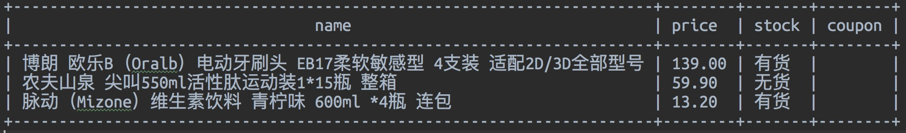

# JDUtil
这是一个可以用于关注一些京东上商品的价格的小脚本, 支持多种参数, 目前支持显示商品名称, 商品是否有货, 以及商品的价格和是否有优惠券. 推荐使用等宽字体, 中文字符的宽度最好是英文字符宽度的两倍, 如 Ubuntu Mono 字体.

## 参数
目前支持的有下列七个参数, 因为已经考虑了参数间的优先级, 所以参数按照任意顺序书写并无影响.

* **-in_path**

可以缩写成 **-I**, 设定该脚本的数据来源的文件, 商品的 id 以及区域代码之类的信息都存储在这个文件中. 默认为脚本当前路径下的 in.txt 文件, 如果没有该文件则会自动创建. 例: -I=./in.txt. 如果参数是 -I=None, 则不从 in_path 中读取数据.

* **-gen_area_code**

可以缩写成 **-G**, 使用该命令可以生成所需要关注的区域的区域代码, 比如福建,厦门市,思明区,城区的区域代码为: 16_1315_1316_53522, 这个是默认的区域代码. 如果需要修改, 直接用该命令生成相应区域代码, 生成后会自动存储到输入in_path文件中. 如果已经知道区域代码, 可以直接用 area_code=16_1315_1316_53522 的格式存储在 in_path 中或者使用 **-set_area_code** 命令. 例: -G.

* **-set_area_code**

可以缩写成 **-S**, 使用该命令可以直接设置区域代码, 且会自动保存到 in_path 中. 例, -set_area_code=16_1315_1316_53522

* **-add_sku_id**

可以缩写成 **-A**, 该命令可以添加要关注的商品, 比如某商品的链接为: https://item.jd.com/848872.html, 那么该商品的 id 为 848872, 所以相应的命令为: -A=848872, 该命令可以添加多个商品, 只需要用半角逗号隔开就行, 如: -A=1416455,848872. 添加成功后会存储到 in_path.

* **remove_sku_id**

可以缩写成 **-R**, 该命令可以删除所关注的商品, 例: -R=1416455,848872. 如果要删除全部关注的商品, 命令为: -R=all.

* **-out_path**

可以缩写成 **-O**, 设定查询到的商品信息输出的位置, 默认位置为当前目录下的 out.txt, 如果使用命令: -O=None, 则会将商品的信息都输出到控制台.

* **-custom_row**

可以缩写成 **-C**, 设置输出的商品信息的格式. P 或者 price 表示价格, S 或者 stock 表示库存, C 或者 coupon 表示优惠券, N 或者 name 表示商品名. 1 表示靠右对齐, 0 表示居中对齐, -1 表示靠左对齐. 例: -C=N:-1,P:0,S:1,C:-1. 通过该命令可以设置商品的一些信息的显示格式, 商品的信息会按照命令中相应的顺序显示, 比如样例命令显示的顺序为商品名称, 商品价格, 商品库存, 优惠券, 默认显示顺序为商品价格, 商品库存, 优惠券, 商品名称. 对齐方式默认为居中对齐. 对齐方式可以不设置, 商品的四种信息如果在命令中没出现则不显示, 如: -C=N,P:0,C:-1.

* **-tight**

可以缩写成 **-T**, 设置商品信息的输出是否要紧凑一些, 默认为不紧凑. 例: -T.

参数的优先级为: -I > -G > -S > -A > -R > -O > -C = -T

其实就是按照解释的顺序减小.

